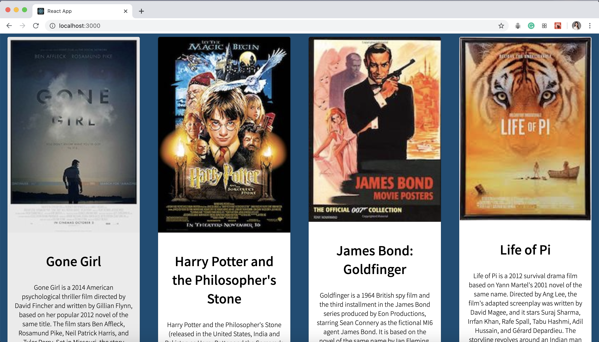

# React-Redux with Sagas

## Description

Duration: 2 days / weekend challenge

This is a full stack application that shows a list of movies.
Built with React, Redux, Saga, Axios, JavaScript, SQL

- The code has comments explaining its purpose

## Usage

- When a user clicks the poster, the user will be guided to the detail page of the movie
- When the user clicks the 'Back to list' button, the application will bring the user back to the movie list page
- When the user clicks the 'Edit' button, the application will bring the user to edit page of the movie
- Users can edit the title and/or description and click the 'Save' button to update data in the database. Or the user can click the 'Cancel' button and go back to the edit page

## Setup

### Database Setup

1. Create a database named `saga_movies_weekend`
2. Run the queries from `database.sql` on the `saga_movies_weekend` database.
3. You will need to create the junction table between the `movies` and `genres` tables!

### Install Dependencies

1. `npm install`
2. `npm run server`
3. `npm run client`

## Screenshot

